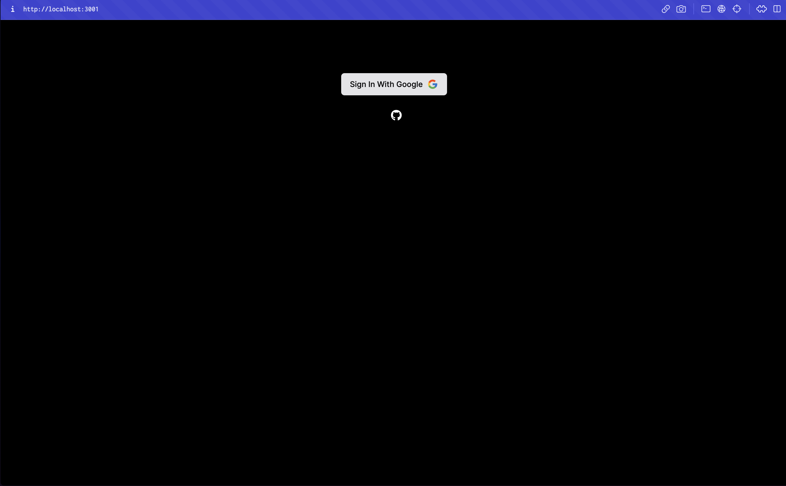
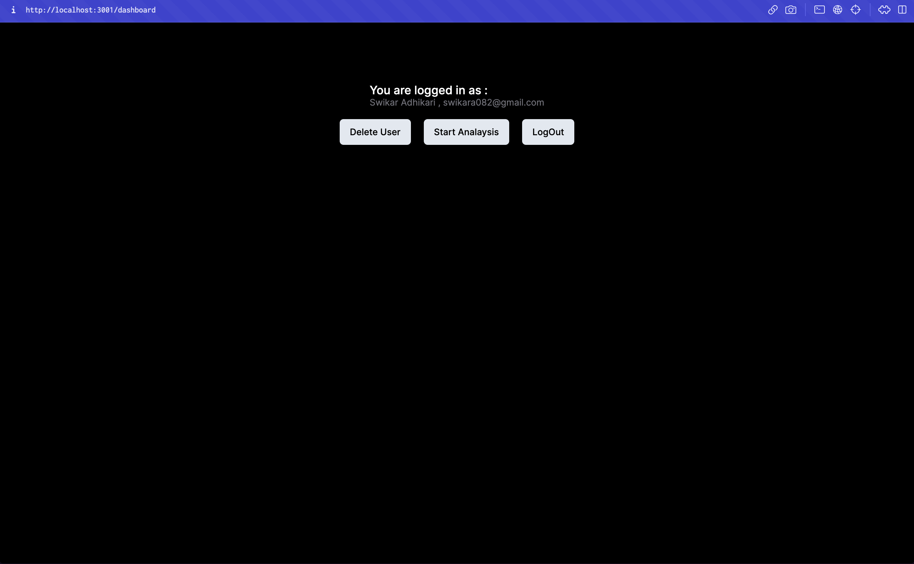
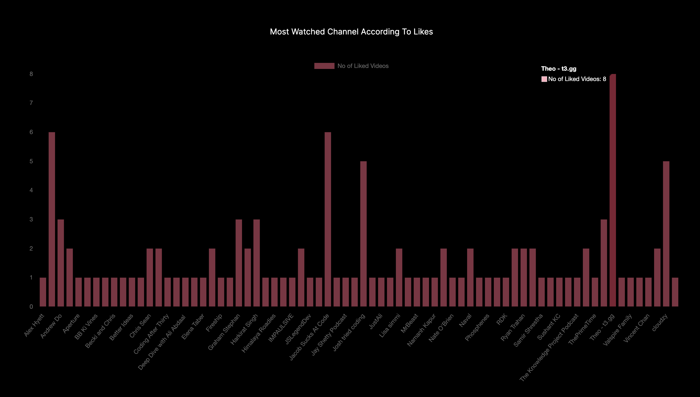
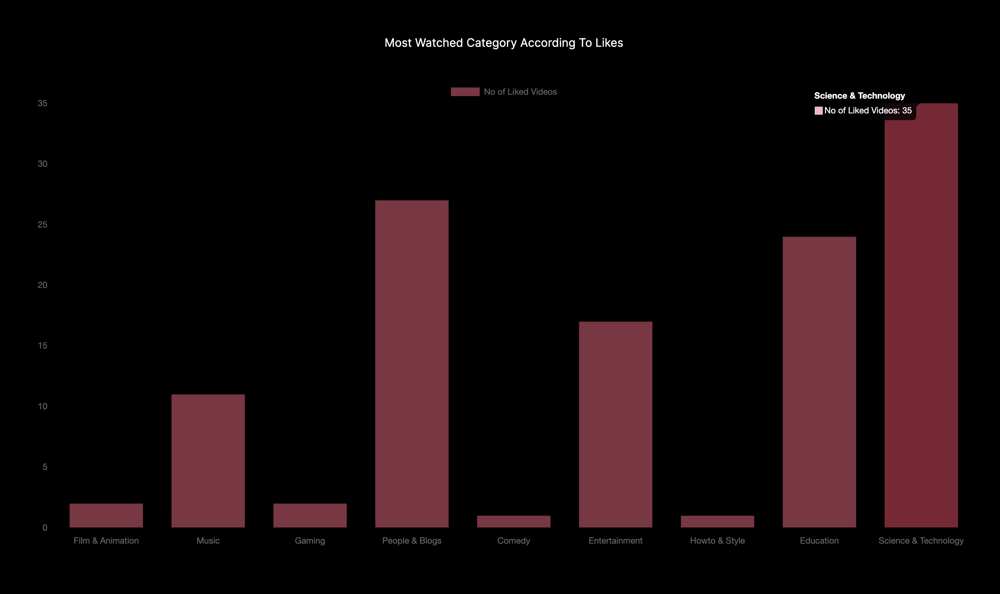

## Youtube Video Analysis

## What is done till now ?

    I have decided not to host this project online because it is the MVP that i
    created to learn Node JS and it is not a complete project. I have attached some
    screenshots of the project below to see the working of the project.

## Watch a short video about the project

## Screenshots

### Login Page

    Just The Basic Login Page Which Implements Google OAuth2.0 and takes you
    google sign in page.

### Logged In Page

     This is the page where you can see the analysis of your liked videos and some
     basic information related to the user

### Analysis Page

    This is the page where you can see the analysis of your liked videos.
    The analysis includes the following:

        * Most Liked Category
        * Most Watched Channel

## How does this work ?

    This is a web app which uses the youtube API to get the liked videos of the user.
    The app then analyzes the data and stores it in a database. The user can then
    view the analysis based on the no of liked videos which is sent through
    backend logic.

### What is it ?

    This is web app allows user to analyze their liked video on youtube.
    The analysis includes the following:

        * Most Liked Category
        * Most Watched Channel

    This is the MVP for the project.

### How to use it ?

    1. Go to the website: (WIP link to hosted soon)
    2. Click on the "Login with Google" button
    3. Click on the "Analyze" button
    4. Wait for the analysis to finish
    5. Enjoy the analysis

### How to run it locally ?

    1. Clone the repo
    2. Create a virtual environment
    3. Install the requirements
    4. Create a .env file with the following variables:
        * SECRET_KEY
        * GOOGLE_CLIENT_ID
        * GOOGLE_CLIENT_SECRET
        * DATABASE_URL
    5. Run the app

### How to contribute ?

    1. Fork the repo
    2. Create a new branch
    3. Make your changes
    4. Create a pull request

## More features in future ?

    This is my side project which i developed intended to learn Node JS. I will be
    adding more features in future or not. If you have any suggestions, feel free to
    open an issue or create a pull request.

## If you like it, please give it a star ⭐

## License

    MIT License

## Author

    [Swikar Adhikari]
